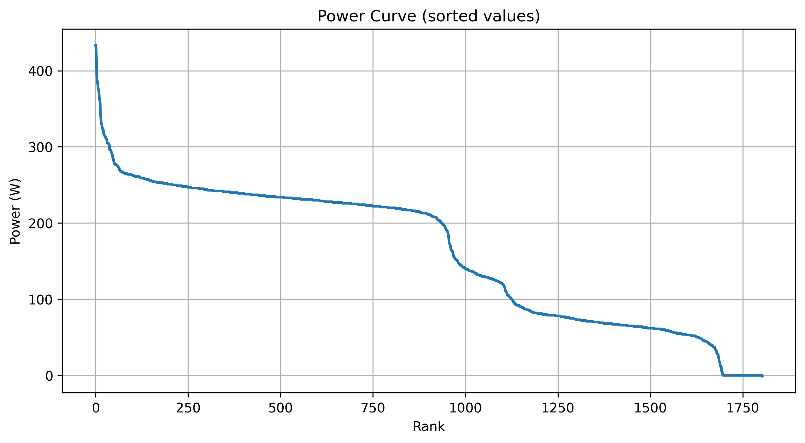

## Anforderungen

- **Python 3.13** oder neuer
- **PDM** (Python Development Master) zur Paketverwaltung

Nutzung und Ausführung
Das Projekt wird über eine zentrale Einstiegsdatei gesteuert.

Hauptprogramm starten
Führen Sie den folgenden Befehl im Terminal aus:

Bash
pdm run python main.py
Ablauf des Programms
Wenn die main.py starten, führt das Programm folgende Schritte automatisch aus:

Laden: Die Daten werden aus data/activity.csv eingelesen.

Berechnung: Die Leistungswerte (Watt) werden in Relation zum Körpergewicht (W/kg) gesetzt.

Sortierung: Die Werte werden mit einem implementierten Bubble-Sort-Algorithmus absteigend sortiert.

Visualisierung: Eine Grafik mit logarithmischer X-Achse (Zeit) wird erstellt und gespeichert.

Gruppe Team: 

Cedric Rissi; Marven Otto
